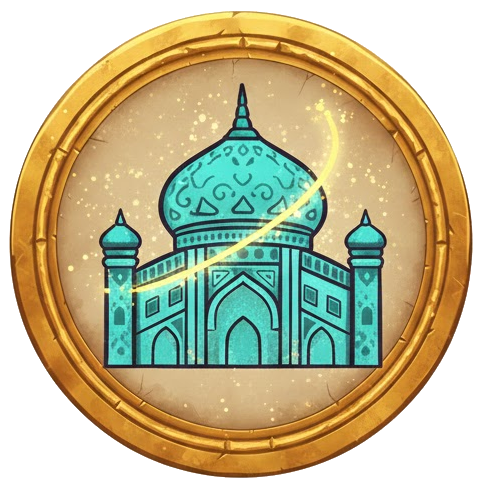
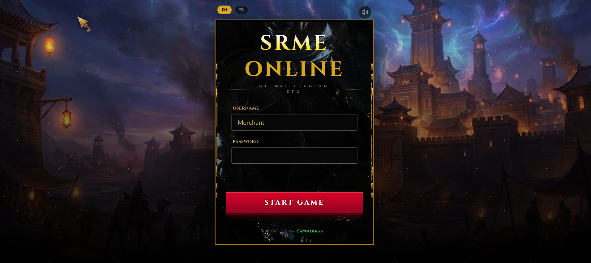
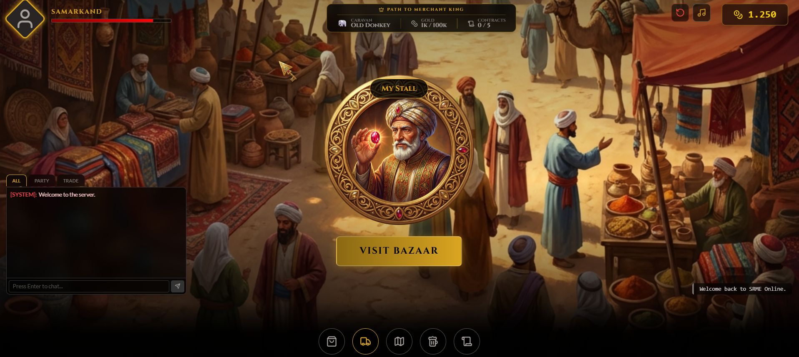
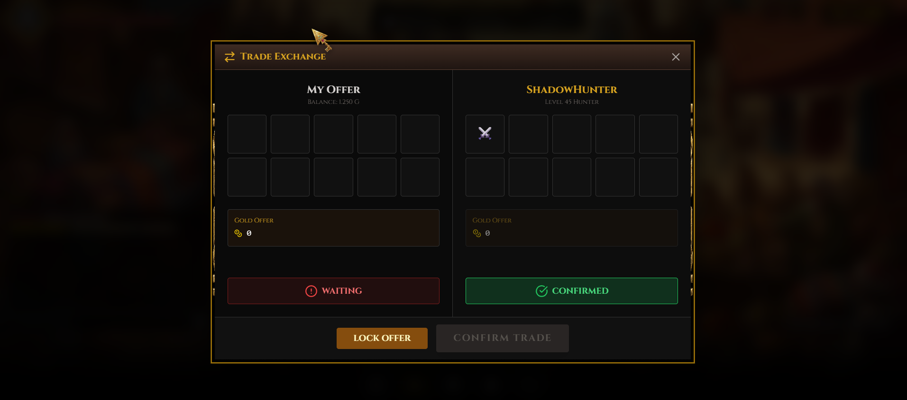
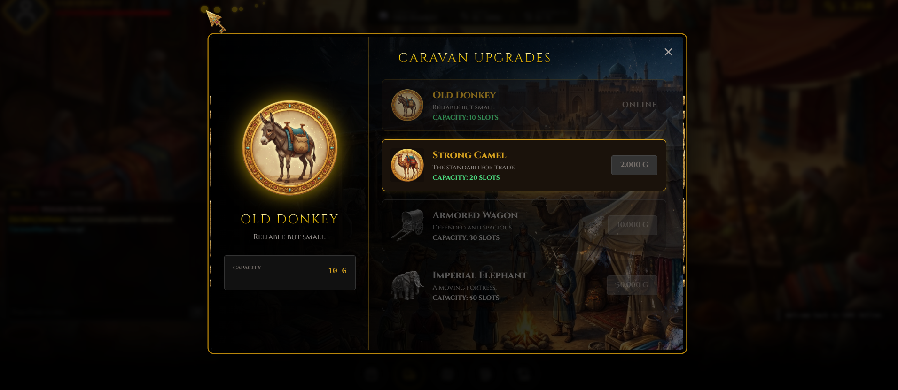

# 🐪 SRME Online

**SRME Online** is a browser-based MMORPG trading game inspired by classic Silk Road Online. Experience the thrill of medieval trade routes, caravan management, and merchant gameplay with a nostalgic 2000s MMORPG aesthetic.



## 📸 Screenshots

<table>
  <tr>
    <td></td>
    <td></td>
  </tr>
  <tr>
    <td></td>
    <td></td>
  </tr>
  <tr>
    <td colspan="2" align="center"></td>
  </tr>
</table>

## ✨ Features

### 🌍 Dynamic Trading System
- **Multi-City Economy**: Trade between Samarkand, Chang'an, and Constantinople
- **Market Fluctuations**: Dynamic pricing based on supply, demand, and random events
- **Bazaar System**: Buy from and sell to AI-controlled merchant stalls
- **Player Stalls**: List your own items for sale and earn passive income

### 🐘 Caravan Management
- **Progressive Upgrades**: Start with a humble donkey, upgrade to imperial elephants
- **Capacity Expansion**: Increase inventory slots from 10 to 50
- **Visual Progression**: Each caravan tier has unique artwork and animations

### 📜 Quest & Contract System
- **Dynamic Quests**: Procedurally generated delivery contracts
- **City-Specific Rewards**: Complete quests to earn gold and reputation
- **Win Condition**: Achieve Merchant King status through wealth and contracts

### 🎮 Classic MMORPG Feel
- **Retro UI**: Golden borders, serif fonts, and RPG-style panels
- **Live Chat System**: Simulated global, party, and trade channels
- **P2P Trading**: Secure player-to-player item exchange with lock/confirm mechanics
- **Random Events**: Bandit ambushes, hidden oases, and safe travels

### 🌐 Bilingual Support
- **English & Turkish**: Full localization for all UI elements, logs, and events
- **Dynamic Language Switching**: Change language on-the-fly from the launcher

## 🚀 Getting Started

### Prerequisites
- Node.js 16+ and npm

### Installation

1. **Clone the repository**
   ```bash
   git clone https://github.com/yourusername/silkroadmerchant.git
   cd silkroadmerchant
   ```

2. **Install dependencies**
   ```bash
   npm install
   ```

3. **Run the development server**
   ```bash
   npm run dev
   ```

4. **Open your browser**
   Navigate to `http://localhost:5173`

### Building for Production

```bash
npm run build
npm run preview
```

## 🎯 How to Play

1. **Launch the Game**: Select your language (EN/TR) and click "Start Game"
2. **Explore the Bazaar**: Visit merchant stalls to buy low-priced goods
3. **Travel Between Cities**: Use the World Map to travel and exploit price differences
4. **Complete Quests**: Accept delivery contracts from the Quest Board
5. **Upgrade Your Caravan**: Invest in larger caravans to carry more goods
6. **Become Merchant King**: Reach 100,000 Gold, max caravan, and 5 completed quests

## 🛠️ Technology Stack

- **Frontend**: React 18 + Vite
- **Styling**: Vanilla CSS with custom RPG theming
- **Animations**: Framer Motion
- **Icons**: Lucide React
- **Audio**: Web Audio API (procedural sound generation)
- **State Management**: React Hooks (useState, useEffect)
- **Localization**: Custom translation system (`translations.js`)

## 📁 Project Structure

```
silkroadmerchant/
├── public/
│   ├── SRMEOnlineFav.png       # Favicon
│   ├── market_bg.png           # City backgrounds
│   ├── merchant.png            # Character sprites
│   └── ...                     # Other assets
├── src/
│   ├── components/
│   │   ├── GameClient.jsx      # Main game logic
│   │   ├── Launcher.jsx        # Login screen
│   │   ├── ChatWidget.jsx      # Chat system
│   │   └── P2PExchange.jsx     # Trading interface
│   ├── utils/
│   │   └── translations.js     # Bilingual text
│   ├── App.jsx                 # Root component
│   ├── main.jsx                # Entry point
│   └── index.css               # Global styles
├── index.html
├── package.json
└── README.md
```

## 🎨 Game Mechanics

### Economy System
- **Base Prices**: Each item has a base market value
- **City Multipliers**: Prices vary by city (e.g., silk is cheap in Chang'an, expensive in Constantinople)
- **Market Events**: Random rumors affect prices (e.g., "Silk shortage in the West!")
- **Haggling**: Negotiate with merchants for better deals

### Progression
- **Gold**: Primary currency, earned through trading and quests
- **Caravan Levels**: 4 tiers (Donkey → Camel → Wagon → Elephant)
- **Quest Completion**: Track progress toward Merchant King status

### Random Events
- **Bandit Ambush** (30% chance): Lose 10% of your gold
- **Hidden Oasis** (20% chance): Find 75 bonus gold
- **Safe Arrival** (50% chance): Uneventful travel

## 🌟 Roadmap

- [ ] Multiplayer support with real P2P trading
- [ ] Guild system for cooperative trading
- [ ] More cities and trade routes
- [ ] Equipment and combat mechanics
- [ ] Leaderboards and achievements

## 🤝 Contributing

Contributions are welcome! Please feel free to submit a Pull Request.

## 📜 License

This project is licensed under the MIT License.

## 🙏 Acknowledgments

- Inspired by **Silk Road Online** (Joymax)
- Built with modern web technologies for a nostalgic experience
- Special thanks to the MMORPG community for feedback and support

---

**Made with ❤️ by Furkan** | [GitHub](https://github.com/yourusername) | [Portfolio](https://yourportfolio.com)
